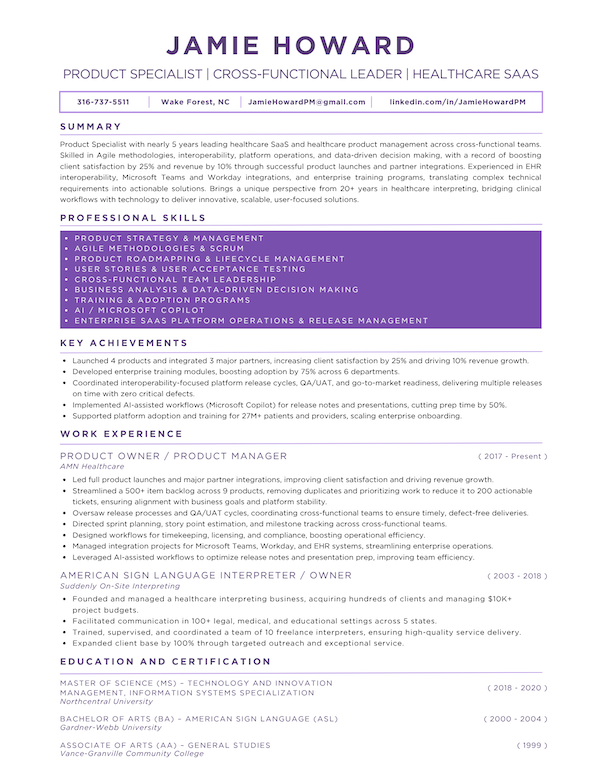

# 💜 Jamie Howard – Product Specialist | Healthcare SaaS

Welcome! This page contains my **professional resume**, highlighting my experience in **healthcare product management, SaaS platform operations, cross-functional team leadership, and interoperability initiatives**.

---

## 📝 Summary
Product Specialist with nearly 5 years leading **healthcare SaaS and healthcare product management** across cross-functional teams. Skilled in **Agile methodologies, interoperability, platform operations, and data-driven decision making**, with a record of **boosting client satisfaction by 25% and revenue by 10%** through successful product launches and partner integrations. Experienced in **EHR interoperability, Microsoft Teams and Workday integrations, and enterprise training programs**, translating complex technical requirements into **actionable solutions**. Brings a **unique perspective from 20+ years in healthcare interpreting**, bridging clinical workflows with technology to deliver **innovative, scalable, user-focused solutions**.

---

## 💡 Key Skills
- **Product Strategy & Management**  
- **Agile Methodologies & Scrum**  
- **Product Roadmapping & Lifecycle Management**  
- **User Stories & User Acceptance Testing**  
- **Cross-Functional Team Leadership**  
- **Business Analysis & Data-Driven Decision Making**  
- **Training & Adoption Programs**  
- **AI / Microsoft Copilot**  
- **Enterprise SaaS Platform Operations & Release Management**  

---

## 📄 Download Resume
Click below to download my full PDF resume:  
[💜 Download PDF Resume](./JamieHoward.pdf)

---

## 📬 Contact
- **Email:** [JamieHowardPM@gmail.com](mailto:JamieHowardPM@gmail.com)  
- **LinkedIn:** [linkedin.com/in/JamieHowardPM](https://linkedin.com/in/JamieHowardPM)  
- **Location:** Raleigh-Durham-Chapel Hill Area North Carolina  

---
