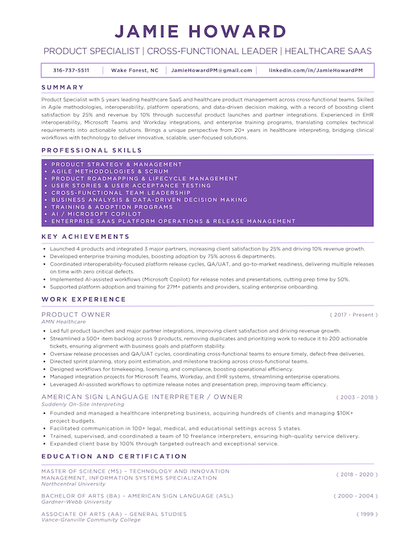

<!-- 
🎨 Color Palette Reference
Primary Purple: #794FAD — used for name headers  
Grey Purple: #5A4279 — used for tagline/subheaders  
Deep Accent Purple: #6A0DAD — used for section headers  
Pastel Lavender: #B590E4 — optional accent/highlight  
Black: #000000 | White: #FFFFFF — neutrals  
-->

## Jamie Howard  
#### Healthcare Product Specialist&nbsp;|&nbsp;Interoperability&nbsp;·&nbsp;SaaS&nbsp;·&nbsp;Workflow Design

---

  

  <a href="./JamieHoward.pdf"><strong>📄 View Full Resume</strong></a> · 
  <a href="https://www.linkedin.com/in/JamieHowardPM"><strong>💬 Connect on LinkedIn</strong></a>

---

## 💬 About Me
I build clarity where healthcare and technology meet.  
For 5 years, I’ve led SaaS and interoperability initiatives that make complex workflows functional, compliant, and user-focused. My foundation in healthcare operations — built over two decades as a medical interpreter — gives me a unique perspective: I understand the human impact of every system, every click, and every delay.

Now, I turn that insight into action — guiding cross-functional teams to design, deliver, and refine solutions that improve how care is coordinated, documented, and delivered. I bring technical fluency, operational empathy, and a drive for simplicity that helps teams move faster and align around what matters.

---

## ⚙️ How I Work
I’m at my best in the space between strategy and execution — defining what success looks like, then working alongside engineers, analysts, and clinical stakeholders to make it real.  

I lead through clarity and consistency: clear requirements, clear priorities, and clear communication. I believe good products don’t just work — they *fit* within existing systems and make everyone’s job easier.

---

## 🌟 Selected Highlights
- Spearheaded **EHR interoperability** initiatives connecting healthcare interpreting workflows with Epic and other leading EHRs  
- Drove the **Zoom integration** for on-demand medical interpreting, simplifying provider access and improving session efficiency  
- Oversaw delivery of a **self-service credential management** portal that reduced support volume by 40%  
- Led migration from **Jira to Azure DevOps**, introducing consistent sprint, QA, and release practices  
- Supported continuous enhancements to AMN’s **Video Remote Interpreting (VRI) platform**, ensuring HIPAA, WCAG, and SOC 2 compliance  

---

## 🧰 Product Toolkit
Azure DevOps · Jira · Figma · Confluence · SQL (basic)  
Epic (EHR) · Workday · Microsoft Teams · Zoom · Copilot · SharePoint  

---

## 💜 What I Believe
Great product work isn’t about features — it’s about *focus*.  
It’s about understanding who you serve, what they need, and how technology can help without getting in the way. My goal is to make healthcare technology invisible — the kind of seamless experience that lets clinicians focus on patients, not platforms.

---

## 🗂️ References & Professional Impressions

> “Jamie brings structure and calm to complex, cross-functional projects. She listens deeply, synthesizes signal from noise, and brings engineering, design, release management, and business stakeholders into a shared plan.” 
> — *Niv Paul, Sr. Scrum Master, AMN Healthcare*

> “Jamie is exceptional at turning ambiguity into an executable roadmap. She keeps cross-functional teams aligned and drives momentum without letting blockers linger. In healthcare, details matter — and she handles them with confidence.” 
> — *Reza Karegaran, Engineering & Software Development Leader, AMN Healthcare*

> “Jamie eagerly dives into new areas, quickly absorbs information, and turns it into opportunity. Her work with generative AI tools raised the bar for the entire product organization.” 
> — *Jeff Shelby, Director of Product Management, AMN Healthcare*

> “Jamie has an exceptional ability to balance strategic vision with execution, always keeping the customer’s needs at the forefront. She’s one of the most dedicated and dynamic Product Managers I’ve worked with.” 
> — *Laurie Anci, Program Manager, AMN Healthcare*

---
---

📬 **Contact**  
📧 [JamieHowardPM@gmail.com](mailto:JamieHowardPM@gmail.com) · 🔗 [LinkedIn](https://www.linkedin.com/in/JamieHowardPM) · 📍 Raleigh-Durham-Chapel Hill, NC  

---

  <a href="./JamieHoward.pdf" style="color:#794FAD;"><strong>📄 View Full Resume</strong></a> · 
  <a href="mailto:JamieHowardPM@gmail.com" style="color:#794FAD;"><strong>✉️ Email Me</strong></a> · 
  <a href="https://www.linkedin.com/in/JamieHowardPM" style="color:#794FAD;"><strong>💬 Connect on LinkedIn</strong></a>

